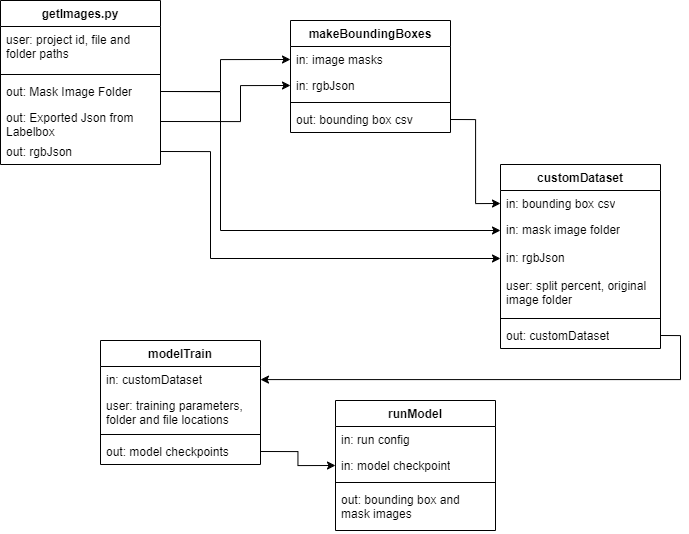

# Sainfoin Leaf Segmentation

## Dependencies: ##
Install the following in a python environment:  
pip install torchvision  
pip install -U albumentations  
pip install pandas  
pip install -U scikit-learn  
pip install pycocotools  
pip install ensemble_boxes  
pip install labelbox  
pip install nicegui (only for QR code extraction)  

## Training and Running the model: ##
**Using the UI**  
Start the UI by running python UI.py in the root directory. Select commands to run from the list. If using a fresh install they should be run in order.
Multiple commands can be run by entering numbers seperated by commas in order. Ex: 0,1,5 will download images from Labelbox, make the rgbJson, then exit.

**UI options**  
0) Download images from Labelbox
Downloads mask images using the labelbox api as well as a json file with the image annotation information.
Images are stored in Data/raw/segmentedImages. The export Json is stored in Data/raw/exportProject.ndjson.  
1\) Make the rgbJson file  
Extracts rgb values and external IDs associated with each annotation in each image from data/raw/exportProject.ndjson.
These values are stored in data/processed/rgbPairs.json.  
2) Make the bounding box csv file  
Uses the segmented images and rgbPairs.json to define a bounding box around each annotation
in the format x1,y1,x2,y2 and store it in data/processed/boundingBoxes.csv  
3) Train a model  
Starts the training process using settings form configs/trainConfig.json.  
4) Run model  
Runs a model using settings from configs/runConfig.json
5) exit

**Training configuration**  
General settings regarding training are set in configs/trainConfig.json. Changes to the model must be made in src/models.py.
The GetTrainingModel function should be edited to make modifications to the model. 
Modifications to model saving should be made at the bottom of the TrainModel function.
The model saves as a .pt file on intervals and at the end of training. It also saves a state dictionary as a .tar at the end of training.

## File Summary: ##
configs/runConfig.json -- configuration for running models.  
configs/trainConfig.json -- configuration for training models.  
data/processed/boundingBoxes.csv -- bounding boxes extracted from the image masks.  
data/processed/rgbPairs.json --  rgb values associated with each annotation generated from exportProject.ndjson.  
data/raw/origionalImages/ -- place the original images here.  
data/raw/run/ -- place images here to run inference on.  
data/raw/segmentedImages/ -- location that labelbox mask images are downloaded to.  
data/raw/exportProject.ndjson -- annotation data downloaded from labelbox.  
model_checkpoints/ -- location model checkpoints are saved to.  
outputs/ -- location images are saved to after inference.  
qrDetection/input/ -- place images here to run qr code extraction on.  
qrDetection/output/ -- renamed images are saved here.  
src/dataPrep.py -- downloads images from labelbox and makes exportProject.ndjson, rgbPairs.json, and boundingBoxes.csv.  
src/datasets.py -- splits the training images for training and validation and defines a custom dataset that is used to feed training data to the model.  
src/models.py -- creates, trains, loads, and runs models.  
src/utils.py -- Utilities mostly related to file IO.  
modelNotes.txt -- notes about several models trained on beocat.  
qrcode.py -- runs a GUI for extracting qr codes from images and renaming the images.  
UI.py -- runs a CLI tool for setting up and running models.  

## Data flow diagram ##

