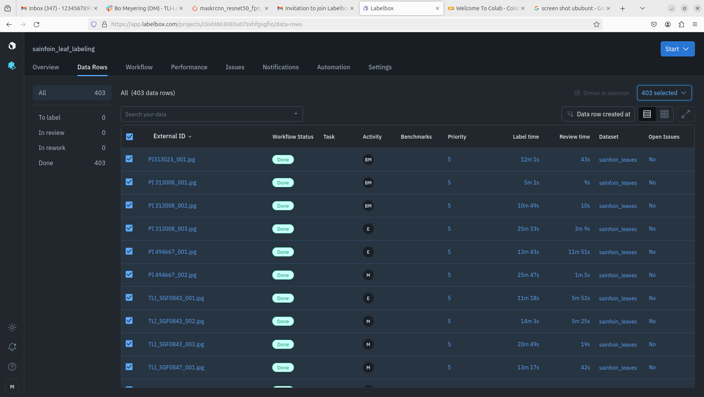

# Sainfoin Leaf Segmentation

## Dependencies: ##

## Training and Running the model: ##
**Using the UI**  
Start the UI by running python UI.py in the root directory. Slect commands to run from the list. If using a fresh install they should be run in order.
Multiple commands can be run by entering numbers seperated by commas in order. Ex: 0,1,5 will download images from Labelbox, make the rgbJson, then exit.

**UI options**  
0) Download images from Labelbox
Downloads mask images using the labelbox api as well as a json file with the image anotation information.
Images are stored in Data/raw/segmentedImages. The export Json is stored in Data/raw/exportProject.ndjson.  
1\) Make the rgbJson file  
Extracts rgb values and external IDs associated with each annoation in each image from data/raw/exportProject.ndjson.
These values are stored in data/processed/rgbPairs.json.  
2) Make the bounding box csv file  
Uses the segmented images and rgbPairs.json to define a bounding box arround each annotation
in the format x1,y1,x2,y2 and store it in data/processed/boundingBoxes.csv  
3) Train a model  
Starts the training process using settings form configs/trainConfig.json.  
4) Run model  
Runs a model using settings from configs/runConfig.json
5) exit

**Training configuration**  
Genral settings regarding training are set in configs/trainConfig.json. Changes to the model must be made in src/models.py.
The GetTrainingModel funciton should be edited to make modifications to the model. 
Modificaitons to model saveing should be made at the botom of the TrainModel function.
The model saves as a .pt file on intervals and at the end off training. It also saves a state dictionary as a .tar at the end of training.

## File Summary: ##

